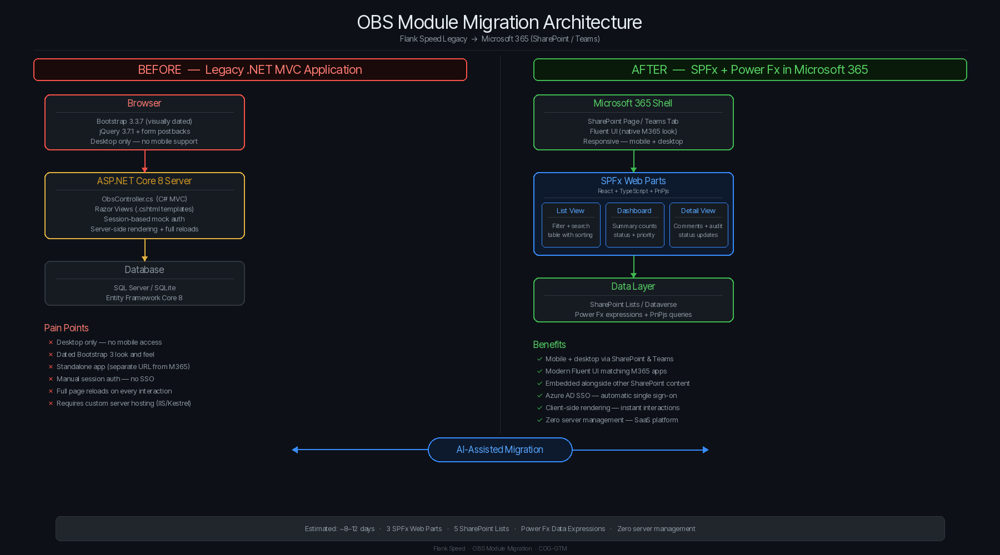

# OBS Module: Before & After Comparison

## Executive Summary

The OBS (Operational Business Systems) module has been migrated from a legacy .NET 8 MVC application to SharePoint Framework (SPFx) web parts with Power Fx data expressions. This document provides a side-by-side comparison of the legacy and modernized architectures.

---

## Architecture Comparison

---

## Feature-by-Feature Comparison

### 1. OBS List View (`/Obs`)

| Aspect | Before (Legacy) | After (SPFx) |
|---|---|---|
| **Technology** | Razor view + HTML table | React DetailsList (Fluent UI) |
| **Styling** | Bootstrap 3.3.7 `<table class="table">` | Fluent UI DetailsList with responsive columns |
| **Filtering** | Server-side LINQ + form postback | Client-side Dropdown + SearchBox with PnPjs queries |
| **Search** | `w.Title.Contains(search)` in C# | `substringof()` OData filter via PnPjs |
| **Sorting** | `.OrderByDescending(w => w.LastUpdatedDate)` | `SortByColumns('OBS Work Items', "LastUpdatedDate", Descending)` |
| **Authentication** | Session cookie (mock user switcher) | Azure AD (automatic via M365 login) |
| **Mobile** | Not responsive | Fully responsive (SPFx + Fluent UI) |
| **Hosting** | IIS / Kestrel | SharePoint Online (zero server management) |

**Visual change:** Legacy Bootstrap table → Modern Fluent UI DetailsList with colored priority badges, persona icons for assigned users, and clickable column headers.

### 2. OBS Dashboard (`/Obs/Dashboard`)

| Aspect | Before (Legacy) | After (SPFx) |
|---|---|---|
| **Summary cards** | Bootstrap panels with inline styles | Fluent UI cards with shadow and grid layout |
| **Status counts** | `GroupBy()` LINQ → ViewBag dictionary | `CountRows(Filter(...))` Power Fx per status |
| **Priority counts** | `GroupBy()` LINQ → ViewBag dictionary | `CountRows(Filter(...))` Power Fx per priority |
| **Team breakdown** | `GroupBy()` LINQ → manual HTML rows | `CountRows(Filter(...))` Power Fx per team |
| **My items queue** | LINQ Where → HTML table | `Filter('OBS Work Items', AssignedTo.Email = User().Email)` |
| **Overdue items** | LINQ Where/Compare → red-bordered panel | `Filter(..., DueDate < Now(), Status.Value <> "Closed")` |
| **Refresh** | Full page reload | Component-level state refresh |

**Visual change:** Flat Bootstrap panels → Card grid with large numeric indicators, color-coded status bars, and an overdue alert section with red border.

### 3. OBS Detail View (`/Obs/Details/{id}`)

| Aspect | Before (Legacy) | After (SPFx) |
|---|---|---|
| **Layout** | `<dl class="dl-horizontal">` definition list | Fluent UI metadata grid with labeled sections |
| **Comments** | HTML list + form postback | React comment cards + inline TextField + Post button |
| **Audit log** | HTML table with 4 columns | Timeline-style audit rows with performer personas |
| **Status update** | Dropdown + form POST to controller | Fluent UI Dropdown + PrimaryButton → `Patch()` via PnPjs |
| **Add comment** | Textarea + form POST | TextField + PrimaryButton → `Patch(Comments, ...)` |
| **User display** | Plain text name | Fluent UI Persona component with avatar |
| **Navigation** | `<a href="/Obs">` back link | `← Back to OBS Records` with hash routing |

**Visual change:** Dense definition list → Clean metadata grid with icons, personas, and card-based comments.

---

## Technology Stack Comparison

| Layer | Before | After |
|---|---|---|
| **Frontend framework** | jQuery 3.7.1 + Razor | React 17 (via SPFx) |
| **UI library** | Bootstrap 3.3.7 | Fluent UI 8 |
| **Backend** | ASP.NET Core 8 MVC | No custom backend (SharePoint hosts everything) |
| **Data access** | Entity Framework Core 8 | PnPjs 3.22 |
| **Query language** | C# LINQ | Power Fx + OData |
| **Authentication** | Session cookies (mock) | Azure AD / M365 (real SSO) |
| **Database** | SQL Server / SQLite | SharePoint Lists (or Dataverse) |
| **Hosting** | IIS / Kestrel / Docker | SharePoint Online (SaaS) |
| **Deployment** | Manual publish / CI pipeline | `.sppkg` to App Catalog |
| **Mobile support** | None (not responsive) | Built-in (SharePoint mobile + Teams mobile) |

---

## User Experience Improvements

### Before
- Desktop-only Bootstrap 3 UI with dated styling
- Manual login / user-switcher (no real auth)
- Full page reloads on every filter change
- No mobile access
- Standalone app (separate URL from other tools)

### After
- Modern Fluent UI matching the rest of Microsoft 365
- Single Sign-On via Azure AD (no separate login)
- Instant filtering with client-side rendering
- Full mobile support (SharePoint mobile app + Teams)
- Embedded alongside other SharePoint content and Teams channels
- Persona components showing user photos from Azure AD
- Accessible (Fluent UI meets WCAG 2.1 AA)

---

## Migration Effort Summary

| Web Part | Legacy Files Replaced | Estimated Effort |
|---|---|---|
| OBS List View | `ObsController.Index()`, `Views/Obs/Index.cshtml` | 2-3 days |
| OBS Dashboard | `ObsController.Dashboard()`, `Views/Obs/Dashboard.cshtml` | 2-3 days |
| OBS Detail View | `ObsController.Details()`, `Views/Obs/Details.cshtml` | 3-4 days |
| Data Service | `AppDbContext.cs`, `SeedData.cs` | 1-2 days (SharePoint list provisioning) |
| **Total** | | **~8-12 days** |

*These estimates assume the SharePoint Lists are already provisioned and accessible. The SPFx web parts include TypeScript models, PnPjs data access, React components, and Fluent UI styling.*

---

## What's Not Migrated (Out of Scope for OBS)

- **CWA Module** → Migrating separately to Power Apps + Power Automate (see CWA migration plan)
- **User management** → Handled by Azure AD / M365 admin (no custom user table needed)
- **Audit logging** → Can leverage SharePoint's built-in versioning + custom Audit Log list
- **File attachments** → SharePoint document libraries (native feature, no custom code needed)
